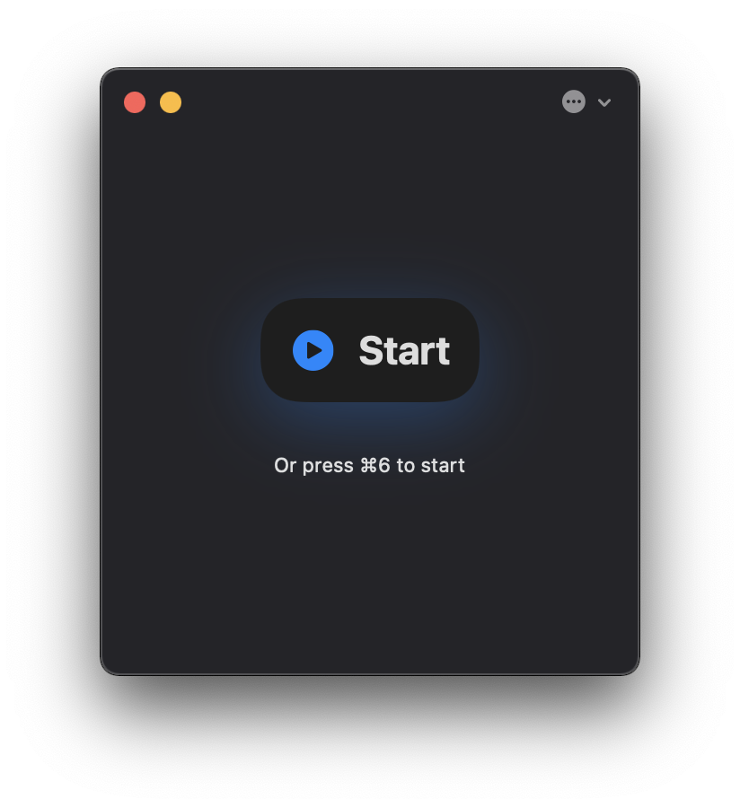
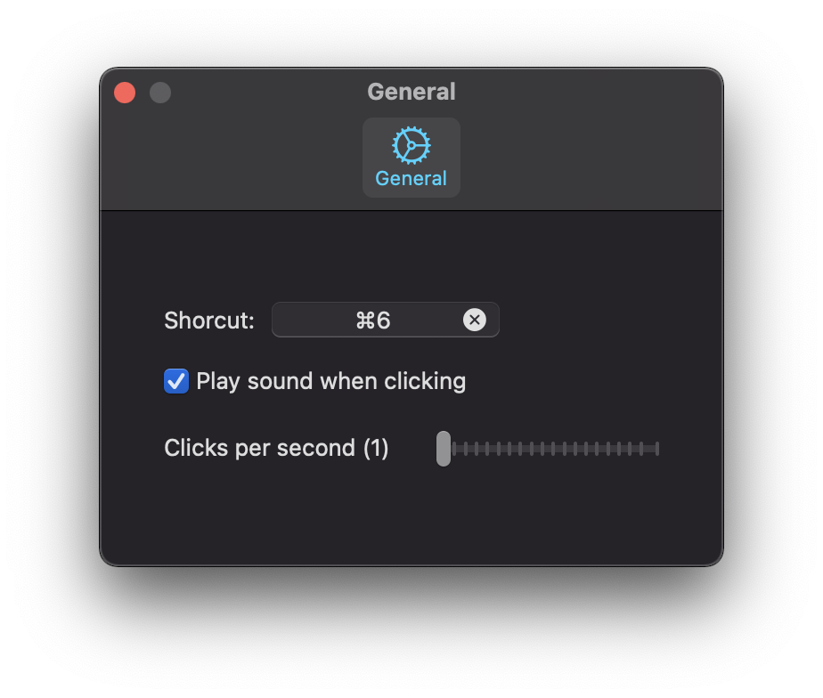

	
	<h1>AutoClicker</h1>
	

		<b>Simulate extremely fast clicks</b>
	

	 
	 

Free and easy-to-use lightweight program that simulates clicking and is designed to produce extremely fast clicks. You can adjust the time between clicks, the clicks per second and more.

## Features

- Change the hotkey to start/stop the auto clicking
- Disable/enable click sound
- Change clicks per second

## Download

[Click here](https://autoclicker.focux.dev/)

Requires macOS 10.15 or later.

## Screenshots

# Support development

Support the development of this app to buy an Apple Developer Subscription so we can publish this app in the App Store and Apple can also notarize our DMG so you don't get the sketchy alert about the app being unsecured.

